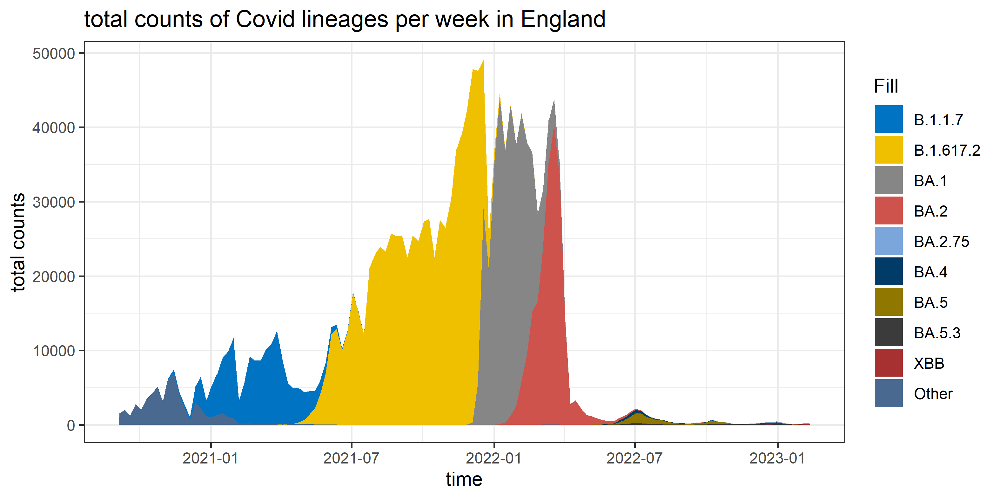
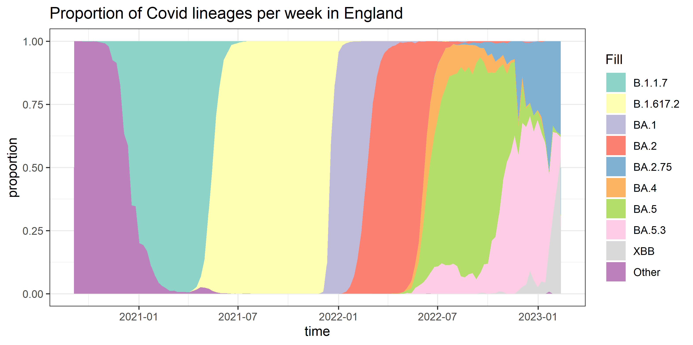
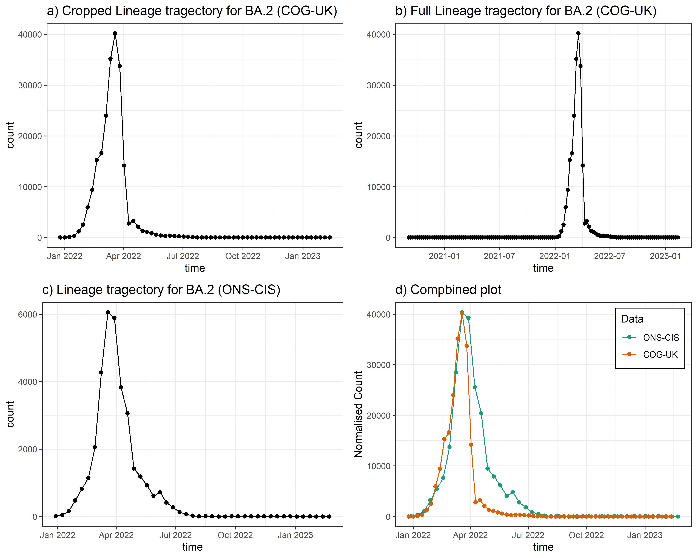
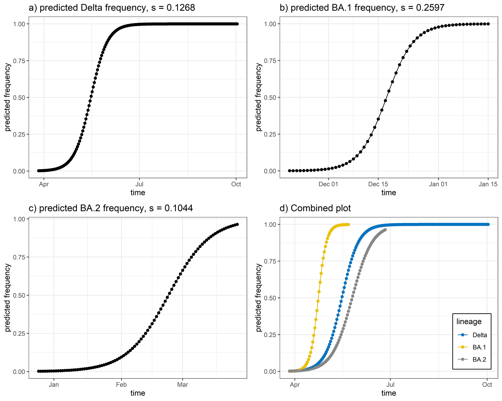
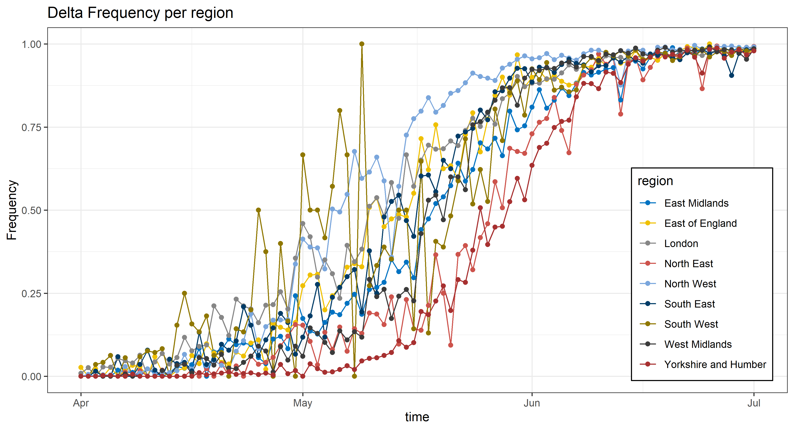
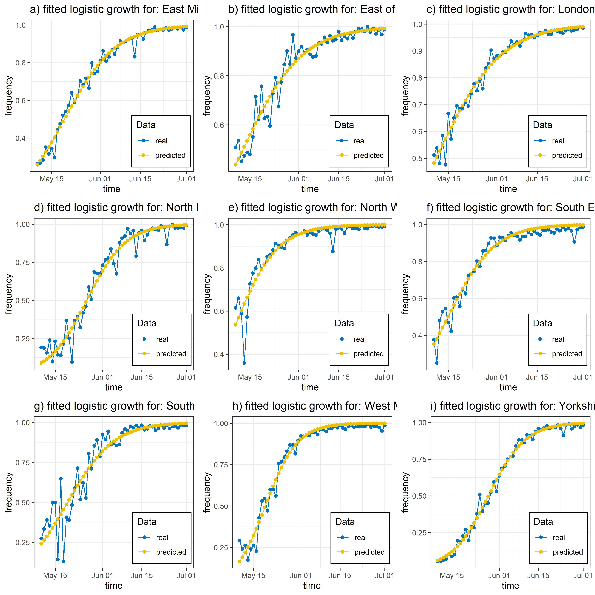
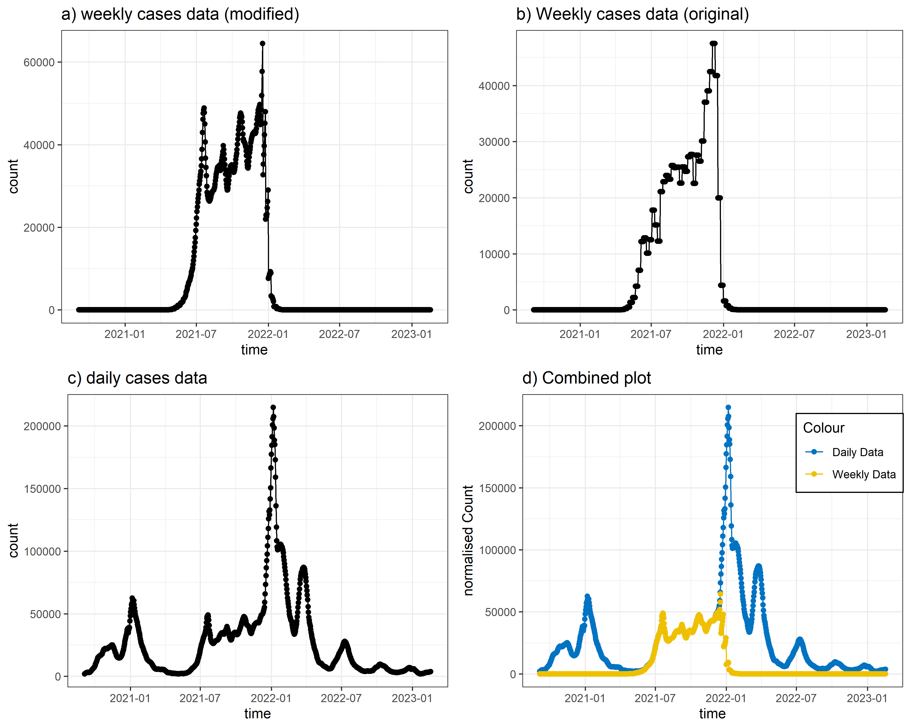
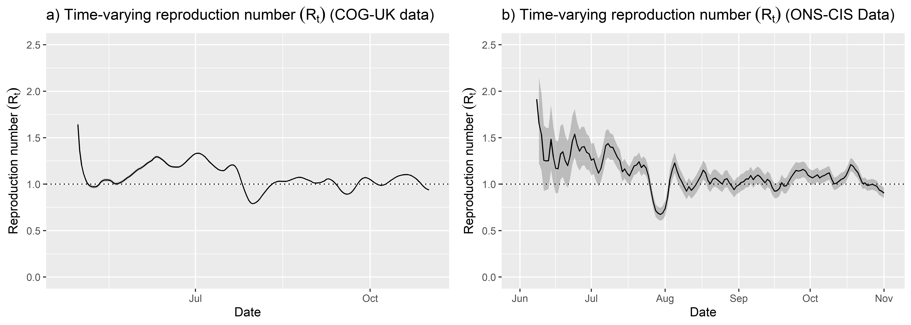

```{r setup, include=FALSE}
knitr::opts_chunk$set(echo = TRUE, warning = FALSE, message = FALSE)
```

```{r loading libraries and functions}
rm(list = ls())

## loading libraries
library(tidyverse)
library(here)
library(RColorBrewer)
library(gridExtra)
library(MCMCpack)
library(EpiEstim)
library(incidence)
library(ggsci)

## installing self made functions
source(here("Data", "Functions.R"))
```

# Introduction

# Question 1

## 1.

```{r loading data}
GenPerWeek <- read.csv(here("Data", "Genomes_per_week_in_England.csv"))
```

## 2.

```{r Changing non major lineages to "Other"}
## defining major lineages
MajLin <- c("B.1.1.7", "B.1.617.2", "BA.1", "BA.2", "BA.2.75", 
            "BA.4", "BA.5", "BA.5.3", "XBB", "Other")

## altering the values in the column to Other if not major
GenPerWeek <- GenPerWeek %>% 
  mutate(lineage = case_when(
    lineage %in% MajLin ~ lineage, TRUE ~ "Other"), # changing values not in major lineages to "Other"
    lineage = factor(lineage, levels = MajLin),date = as.Date(date)) %>%  # converting the lineage into categorical factors and the date into a date
  group_by(date, lineage) %>% # grouping values from the same lineage and week
  summarise(count = sum(count)) # adding them all together into one value
```

## 3.

```{r visualation in a stacked area plot}
## using a self made function to create the stacked area plot
stacked_area_plot(GenPerWeek, GenPerWeek$date, "time", GenPerWeek$count,
                  "total counts", GenPerWeek$lineage, 
                  "total counts of Covid lineages per week in England",
                  "TotalCountsAP.png")
```



```{r Proportion graph}
## calculation proportion values
# creating a new dataframe which contains the total counts for each week
TotCount <- aggregate(GenPerWeek$count, by = list(date = GenPerWeek$date), 
                      FUN = sum)
# changing the column names so it can be added back
colnames(TotCount) <- c("date", "total_count")
# adding the total counts to each row from a set week
GenPerWeek <- merge(GenPerWeek, TotCount, by = "date")
# creating a new column with the calculated proportion
GenPerWeek$proportion <- GenPerWeek$count / GenPerWeek$total_count

## using a self made function to create the stacked area plot
stacked_area_plot(GenPerWeek, GenPerWeek$date, "time", GenPerWeek$proportion,
                  "proportion", GenPerWeek$lineage, 
                  "Proportion of Covid lineages per week in England", 
                  "ProportionAP.png")
```



# Question 2

## 1.

```{r Loading Data}
## downloading data
ONSData <- read.csv("https://raw.githubusercontent.com/mg878/variant_fitness_practical/main/lineage_data.csv")
ONSData$collection_date <- as.Date(ONSData$collection_date)

## Data wrangling
# combining values from the same lineage together
ONSSum <- aggregate(ONSData$major_lineage,
                    by = list(collection_date = ONSData$collection_date, 
                              major_lineage = ONSData$major_lineage), FUN = length)
# changing collumn names
colnames(ONSSum) <- c("collection_date", "major_lineage", "lineage_count")

```

```{r calculations}
## totals
# combining all values with the same collection date
total_counts <- aggregate(ONSSum$lineage_count, 
                          by = list(collection_date = ONSSum$collection_date), 
                          FUN = sum)
# change names to fit the original dataframe
colnames(total_counts) <- c("collection_date", "total_count")
# add to the original dataframe
ONSSum <- merge(ONSSum, total_counts, by = "collection_date")

## calculate frequencies
ONSSum$lineage_frequency <- ONSSum$lineage_count / ONSSum$total_count

## grouping data into 10s
# creating a column with dates grouped into 10s 
ONSSum$collection_date_bin <- as.Date(floor(as.numeric(
  as.Date(ONSSum$collection_date)) / 10) * 10, 
  origin = "1970-01-01")
# creating a new dataframe with each 10 day period summed
ONSSumBin <- aggregate(lineage_count ~ collection_date_bin + major_lineage, 
                       data = ONSSum, FUN = sum)
# Calculate total counts within each bin
total_counts <- aggregate(lineage_count ~ collection_date_bin,
                          data = ONSSumBin,FUN = sum)
#change to fit with original dataframe
colnames(total_counts) <- c("collection_date_bin", "total_count") 
# add back to dataset
ONSSumBin <- merge(ONSSumBin, total_counts, by = "collection_date_bin")
# Recalculate frequencies
ONSSumBin$lineage_frequency <- ONSSumBin$lineage_count / ONSSumBin$total_count
```

```{r}
## Data wrangling
# creating dataframe with only BA.2 and only the relevant columns
ONSBA2 <- subset(ONSSumBin, major_lineage == "BA.2", 
                 select = c(collection_date_bin, lineage_count))
# renaming columns for easy combination later
colnames(ONSBA2) <- c("date", "count")
# creating a new dataframe with values normalised to match the COG data
ONSBA2c <- ONSBA2 %>% mutate(count = count * 6.2)
# adding a factor column to identify these values as ONS-CIS derived
ONSBA2c$Data <- as.factor("ONS-CIS")
  
# creating dataframe with only BA.2 and only the relevant columns  
COGBA2 <- subset(GenPerWeek, lineage == "BA.2",
                 select = c("date", "count"))
# creating a new dataframe with the same time period as the ONS-CIS data
COGBA2c <- subset(COGBA2, date > as.Date("2021-12-18"))
# adding a factor column to identify these values as COG-UK derived
COGBA2c$Data <- as.factor("COG-UK")

# creating a combined dataset
Both <- bind_rows(ONSBA2c, COGBA2c)

## Plotting
# creating a plot for the ONS-CIS data using a self made function
ONSPlot <- single_lineage_plot(ONSBA2, ONSBA2$date, "time", ONSBA2$count, "count", 
                               "c) Lineage tragectory for BA.2 (ONS-CIS)")
# creating a plot for the COG-UK data using a self made function
COGPlot <- single_lineage_plot(COGBA2, COGBA2$date, "time", COGBA2$count, "count", 
                               "b) Full Lineage tragectory for BA.2 (COG-UK)")
# creating a plot for the cropped COG-UK data using a self made function
COGPlot2 <- single_lineage_plot(COGBA2c, COGBA2c$date, "time", COGBA2c$count,
                               "count", 
                               "a) Cropped Lineage tragectory for BA.2 (COG-UK)")
# creating a plot with both datasets shown together
BothPlot <- multi_lineage_plot(Both, Both$date, "time",Both$count, "normalised Count", 
                               Both$Data, "Dataset", "d) Combined plot", c(0.86, 0.80))
## combinging and saving plot
# defining saving parameters
grid_plot("BA2LinPlot.png", COGPlot2, COGPlot, ONSPlot, BothPlot)
```



## 2.

Both datasets show very similar trajectories. When the count is increasing they are almost identical, starting at about the same time and growing at similar rates. They both peak at about the same time as well. However, the decrease in count after the peak is different for the ONS-CIS data taking substantially longer and having a more gradual curvature compared to the COG-UK data which has a sudden and more linear drop off.

The most likely cause for this discrepancy is the difference in sampling techniques. COG-UK data was taken from PCR testing, wherase ONS-CIS used random samples from the population. Many people would test positive for the strain long after it was causing symptoms. On top of this, people were likely to get tested early on into their infection, with a long period afterwards in which it could still be tested. Therefore, random testing of individuals is likely to pick up their infection later into it's cycle and lead to the delayed drop that we see.

# Question 3

```{r Data wrangling}
## filtering by lineage and dates
# Delta
COGDeltaM <-  filter(GenPerWeek, lineage == "B.1.617.2", # Lineage
                                date >= as.Date("2021-03-27") & # date from
                                  date <= as.Date("2021-10-02")) # date until
# BA.1
COGBA1M <- filter(GenPerWeek, lineage == "BA.1", # Lineage
                                date >= as.Date("2021-11-20") & # date from
                                  date <= as.Date("2022-01-15"))# date until
# BA.2
COGBA2M <- filter(GenPerWeek, lineage == "BA.2", # Lineage
                                date >= as.Date("2021-12-25") & # date from
                                  date <= as.Date("2022-03-26"))# date until
```

```{r running models}
## Delta Model
# defining the logistic growth equation
COGDeltaMFit <- nls(proportion ~ logistic_growth(as.numeric(date - min(date)),
                                                 s, f0), data = COGDeltaM,
                    start = list(s = 0.2, f0 = min(COGDeltaM$proportion)))
# setting the period of interest
COGDeltaMDates <- seq(min(COGDeltaM$date), max(COGDeltaM$date), by = "1 day")
# Calculating predicted frequencings from model
COGDeltaMPred <- data.frame(date = COGDeltaMDates,
  predicted_frequency = logistic_growth(as.numeric(COGDeltaMDates - 
                                                     min(COGDeltaM$date)),
                                        coef(COGDeltaMFit)["s"], 
                                        coef(COGDeltaMFit)["f0"]))
# Labelling values as the Delta strain
COGDeltaMPred$Data <- as.factor("Delta")


## BA.1 Model
# defining the logistic growth equation
COGBA1MFit <- nls(proportion ~ logistic_growth(as.numeric(date - min(date)),
                                                 s, f0), data = COGBA1M,
                    start = list(s = 0.2, f0 = min(COGBA1M$proportion)))
# setting the period of interest
COGBA1MDates <- seq(min(COGBA1M$date), max(COGBA1M$date), by = "1 day")

# Calculating predicted frequencings from model 
COGBA1MPred <- data.frame(date = COGBA1MDates,
  predicted_frequency = logistic_growth(as.numeric(COGBA1MDates - 
                                                     min(COGBA1M$date)),
                                        coef(COGBA1MFit)["s"], 
                                        coef(COGBA1MFit)["f0"]))
# Labelling values as the BA.1 strain
COGBA1MPred$Data <- as.factor("BA.1")
# creating a new dataset
COGBA1MPred1 <- COGBA1MPred
# setting the dates to that of the Delta strain
COGBA1MPred1$date <- as.Date(as.Date(COGBA1MPred1$date)-238)


## BA.2 Model
# defining the logistic growth equation
COGBA2MFit <- nls(proportion ~ logistic_growth(as.numeric(date - min(date)),
                                                 s, f0), data = COGBA2M,
                    start = list(s = 0.2, f0 = min(COGBA2M$proportion)))
# setting the period of interest
COGBA2MDates <- seq(min(COGBA2M$date), max(COGBA2M$date), by = "1 day")

# Calculating predicted frequencings from model 
COGBA2MPred <- data.frame(date = COGBA2MDates,
  predicted_frequency = logistic_growth(as.numeric(COGBA2MDates - 
                                                     min(COGBA2M$date)),
                                        coef(COGBA2MFit)["s"], 
                                        coef(COGBA2MFit)["f0"]))
# Labelling values as the Delta strain
COGBA2MPred$Data <- as.factor("BA.2")
# creating a new dataset
COGBA2MPred1 <- COGBA2MPred
# setting the dates to that of the Delta strain
COGBA2MPred1$date <- as.Date(as.Date(COGBA2MPred1$date)-273)

## combining all predictions into one dataset
COGCombMPred <- bind_rows(COGDeltaMPred,COGBA1MPred1,COGBA2MPred1)
```

```{r plotting}
## making plots
# plotting Delta using a self made function
COGDeltaMPredPlot <- single_lineage_plot(COGDeltaMPred, COGDeltaMPred$date,
                                         "time",
                                         COGDeltaMPred$predicted_frequency,
                                         "predicted frequency", 
                                         paste("a) predicted Delta frequency, s =",
                                               round(coef(COGDeltaMFit)["s"],4)))

# plotting BA.1 using a self made function
COGBA1MPredPlot <- single_lineage_plot(COGBA1MPred, COGBA1MPred$date,
                                         "time",
                                         COGBA1MPred$predicted_frequency,
                                         "predicted frequency", 
                                         paste("b) predicted BA.1 frequency, s =",
                                               round(coef(COGBA1MFit)["s"],4)))

# plotting BA.2 using a self made function
COGBA2MPredPlot <- single_lineage_plot(COGBA2MPred, COGBA2MPred$date,
                                         "time",
                                         COGBA2MPred$predicted_frequency,
                                         "predicted frequency", 
                                         paste("c) predicted BA.1 frequency, s =",
                                               round(coef(COGBA2MFit)["s"],4)))

# creating a plot with all datasets shown together
COGCombMPredPlot <- multi_lineage_plot(COGCombMPred, COGCombMPred$date, "time",
                                       COGCombMPred$predicted_frequency, "predicted frequency",
                                       COGCombMPred$Data, "lineage", "d) Combined plot", 
                                       c(0.88, 0.23))
## combinging and saving plot
grid_plot("COGCombPredPlot.png", COGDeltaMPredPlot, COGBA1MPredPlot, COGBA2MPredPlot, 
         COGCombMPredPlot)

```



BA.1 reached fixation the fastest and had the highest selective advantage at 2.597, Delta was then second with s = 0.1268 and lastly BA.2 with s = 0.1044.

# Question 4

## 1.

```{r Loading Delta dataset}
## loading the data
DeltaD2 <- readRDS(here("Data", "delta-d2.rds"))
# ensuring there are no values without regions
DeltaD2 <- subset(DeltaD2, phecname != "")
# ensuring the date is properly formatted
DeltaD2$date <- as.Date(DeltaD2$date)

##calculating frequencies
DeltaD2Freq <- DeltaD2 %>%
  group_by(phecname, date) %>% # grouping dates and regions
  summarise(count = sum(Delta == TRUE), ND = sum(Delta == FALSE), # calculating numbers of Delta and Non-Delta
            frequency = count / (count + ND)) # calculating the frequency of Delta vs Non-Delta
```

## 2.

### i.

```{r plotting delta frequencies by region}
## plotting delta frequencies using a self made plot
DeltaByReg <- multi_lineage_plot(DeltaD2Freq, DeltaD2Freq$date, "time", DeltaD2Freq$frequency,
                                 "Frequency", DeltaD2Freq$phecname, "region", 
                                 "Delta Frequency per region", c(0.8835,0.4))
# saving to png seperately
png(filename = here("Figures", "DeltaByReg.png"), height = 10, width = 20, 
    units = "cm", res = 400)
print(DeltaByReg)
dev.off()
```



### ii.

```{r Loop for creating each model and plot}
## setting up data and parameters for loop
# Filtering to only relevant datapoints
DeltaD2M <- filter(DeltaD2Freq, date >= as.Date("2021-05-10"))
# getting a list of each region name
Names <- unique(as.character(DeltaD2M$phecname))
# setting an integer for which iteration is occuring
n <- 1
# making a list of letters for titles
letters <- c("a", "b", "c", "d", "e", "f", "g", "h", "i")

### for loop
## creating a loop to go through each of the region names
for (Name in Names){
  ## getting data
  # getting the data for the region in question
  Temp <- filter(DeltaD2M, phecname == Name)
  # dropping unecessary columns
  Temp <- Temp %>% subset(select=c(date, frequency))
  
  ## creating the model
  # defining the logistic growth equation
  TempFit <- nls(frequency ~ logistic_growth(as.numeric(date - min(date)),
                                              s, f0), data = Temp,
                 start = list(s = 0.1, f0 = min(Temp$frequency)))
  # setting the period of interest
  TempDates <- seq(min(Temp$date), max(Temp$date), by = "1 day")
  # Calculating predicted frequencings from model
  TempPred <- data.frame(date = TempDates,
    frequency = logistic_growth(as.numeric(TempDates - 
                                                     min(Temp$date)),
                                        coef(TempFit)["s"], 
                                        coef(TempFit)["f0"]))
  
  ## setting up data for the plot
  # setting up the title for the plot inclduing the S value to 4d.p.
  TempTitle <- paste(letters[n], ") ", Name, ", S = ", round(coef(TempFit)["s"], 3), 
                     ", F0 =", round(coef(TempFit)["f0"], 3),  sep = "")
  # labelling each value from the original data
  Temp$Data <- as.factor("real")
  # labelling each value from the predicted data
  TempPred$Data <- as.factor("predicted")
  # combining both datasets into one
  TempComb <- bind_rows(Temp, TempPred)
  
  ## plotting
  # defining the plot
  TempPlot <- ggplot(TempComb, aes(x = date, y = frequency, colour = Data)) +
    geom_line() + # creating the line
    geom_point() + # creating the points
    scale_colour_jco() + # setting the colour palette
    theme_bw() + # setting other visual parameters
    labs(x = "time", y = "frequency", title = TempTitle) + # labelling
    theme(legend.position = c(0.8,0.2), # ensuring correct legend location
          legend.background = element_rect(fill = "white", color = "black"))
  
  ## final 
  # outputting the graph to a variable plot(n)
  assign(paste("plot", as.character(n), sep = ""), TempPlot)
  # incrementing n by 1 to show moved onto next iteration
  n <- n + 1
}
#
```

```{r group plot}
# setting the file parameters
png(filename = here("Figures", "RegPlots.png"), height = 34, width = 34, units = "cm", res = 600)
  # defining positions
  grid.arrange(plot1, plot2, plot3, plot4, plot5, plot6, plot7, plot8, plot9, ncol = 3)
  dev.off()
```



## 3.

### i.

The West Midlands had the fastest outbreak with an S of 0.1751.

The North West had the earliest rise in frequencies with an F0 of 0.537.

Difference in time of rise was likely caused by the connections of Locations to each other and do locations outside of England. Locations with large airports for instance are likely candidates for entry of a new strain into the country. Speed of outbreak will be determined by many conditions, including both the movement of people, but also the sucseptibility of the population. Potentially there are greater proportions of young and elderly people in the West Midlands, or a greater proportion of people who had not been exposed to any form of Covid before.

### ii.

The founder's effect is when a small selection of the total disease population enters a new separated host population, such as a geographical area. This small selection has only a fraction of the genetic diversity of the larger population and so all people infected by it will be infected by genetically similar strains. When using Logistic growth models this can lead to an increased S compared to situations where the founder's effect is not occuring.

The data from our analysis supports the conclusion that the founder's effect is leading to differences in growth across different regions, we see a large variety in S values from 0.9 to 1.75 (almost a 2 fold difference) meaning that the rate of growth is almost twice as fast in some areas compared to others. This is good evidence that a founder's effect style interaction is occuring to lead to this discrepancy.

# Question 5

## 1.

```{r preparing datasets}
## loading daily data
# loading from file
DailyCases <- read.csv(here("Data", "daily-new-confirmed-covid-19-cases.csv"))
# changing the column names to match other datasets
colnames(DailyCases) <- c("date", "count")
# ensuing the date is formatted as a date
DailyCases$date <- as.Date(DailyCases$date)

## preparing ONS-CIS data
# taking only Delta data and only necessary columns
SimpleGPW <- subset(GenPerWeek, lineage == "B.1.617.2", select = c(date, count, proportion))
# altering the data to show each day independently
SimpleGPW <- SimpleGPW %>%
  rowwise() %>%
  mutate(date = list(seq.Date(from = date, by = "day", length.out = 7))) %>%
  ungroup() %>%
  unnest(cols = date)

## matching time period between them
DailyCases <- subset(DailyCases, date >= as.Date(min(SimpleGPW$date)) & 
                           date <= as.Date(max(SimpleGPW$date)))

## calculating modified count
# storing the original count seperately
SimpleGPW$og_count <- SimpleGPW$count
# replacing the count value with the modified version
SimpleGPW$count <- SimpleGPW$proportion * DailyCases$count

## combining datasets
# labelling daily case data
DailyCases$Data <- as.factor("Daily Data")
# labelling weekly case data
SimpleGPW$Data <- as.factor("Weekly Data")
# created a dataset combining both datasets
DayVWeek <- bind_rows(DailyCases, SimpleGPW)
```

```{r plotting}
## Plotting
# creating a plot for the ONS-CIS data using a self made function
WeeklyPlot1 <- single_lineage_plot(SimpleGPW, SimpleGPW$date, "time",
                                  SimpleGPW$count, "count", "a) weekly cases data (modified)")
# creating a plot for the COG-UK data using a self made function
DailyPlot <- single_lineage_plot(DailyCases, DailyCases$date, "time", DailyCases$count, 
                                 "count", "c) daily cases data")
# creating a plot for the cropped COG-UK data using a self made function
WeeklyPlot2 <- single_lineage_plot(SimpleGPW, SimpleGPW$date, "time", SimpleGPW$og_count,
                               "count", 
                               "b) Weekly cases data (original)")
# creating a plot with both datasets shown together
DVWPlot <- multi_lineage_plot(DayVWeek, DayVWeek$date, "time",DayVWeek$count, "normalised Count", 
                               DayVWeek$Data, "Dataset", "d) Combined plot", c(0.86, 0.80))

## combinging and saving plot
# defining saving parameters
grid_plot("DVWPlot.png", WeeklyPlot1, WeeklyPlot2, DailyPlot, DVWPlot)
```



the data seems to perfectly match up but just for a short while??? so like small

## 2.

```{r Rt measurement}
## preparing data
# subsetting data to only values from the correct period
RtData <- subset(DailyCases, date >= as.Date("2021-04-23") &
                   date <= as.Date("2021-11-01"), select = c(date, count))
# renaming columns to work with esitmate_R()
colnames(RtData) <- c("dates", "I")
# defining config values
SerialInt <- list(mean_si = 4.1, std_si = 2.8)

## estimation of Rt
RtResults <- estimate_R(incid = RtData, method = "parametric_si",
                        config = make_config(SerialInt))
```

```{r ONS-CIS Rt from practical}
## loading incidence data saved from the practical code
# loading the data from the ONS-CIS
ONSRtData <- read.csv(here("Data", "incidence_data_ONS.csv"))
# selecting only the relevant data
ONSRtData <- subset(ONSRtData, select = c(dates, I))
# ensuring the dates are formatted correctly
ONSRtData$dates <- as.Date(ONSRtData$dates)

## estimating Rt for the ONS dataset
ONSRtResults <- estimate_R(incid = ONSRtData, method = "parametric_si",
                        config = make_config(SerialInt))
```

```{r Rt plot creation}
## defining individual plots
# creating the plot for the daily data
RtPlot <- plot(RtResults, what = "R", legend = FALSE) +
  labs(title = expression("a) Time-varying reproduction number" ~ (R[t]) ~ 
                            "(Daily Data)"),
       x = "Date", y = expression("Reproduction number" ~ (R[t]))) +
  ylim(c(0,2.5))
# creating the plot for the ONS-CIS data
ONSRtPlot <- plot(ONSRtResults, what = "R", legend = FALSE) +
  labs(title = expression("b) Time-varying reproduction number" ~ (R[t]) ~ 
                            "(ONS-CIS Data)"),
       x = "Date", y = expression("Reproduction number" ~ (R[t]))) +
  ylim(c(0,2.5))

## combining plots as a png
# defining png parameters
png(filename = here("Figures", "RtPlot.png"), height = 10, width = 28, units = "cm", res = 600)
# defining the multiplot
grid.arrange(RtPlot, ONSRtPlot, ncol = 2)
dev.off()
```



```{r initial values, echo=FALSE}
## displaying the initial values
cat("--- Initial Rt values ---\n")
cat("Daily Data: ", RtResults$R$`Mean(R)`[1], "\n")
cat("ONS-CIS Data: ", ONSRtResults$R$`Mean(R)`[1], "\n")
```

------------------------------------------------------------------------

# Appendix

::: {#refs}
:::

## Contents of Functions.R

```{r eval=FALSE, include=TRUE}
###########################################
# Functions for Sars Covid 19 assignment
# author: anonymous
###########################################

###Logistic Growth
logistic_growth <- function(t, s, f0) {
  (f0 * exp(s * t)) / (1 + f0 * (exp(s * t) - 1)) # defining the logistic growth equation
}

### stacked area plot
stacked_area_plot <- function(Data, Xaxis, Xtitle, Yaxis, Ytitle, Fill, Title, File) {
  ## creating the plot
  temp <- ggplot(Data, aes(x = Xaxis, y = Yaxis, fill = Fill)) +
    geom_area() + # setting to area plot
    scale_fill_jco() + # setting the palette
    theme_bw() +
    labs(x = Xtitle, y = Ytitle, title = Title)
  ## saving as a png
  png(filename = here("Figures", File), height = 10, width = 20, units = "cm", res = 400)
  print(temp)
  dev.off()
}

#### lineage plots
### single
single_lineage_plot <- function(Data, Xaxis, Xtitle, Yaxis, Ytitle, Title) {
  ## creating plot
  temp <- ggplot(Data, aes(x = Xaxis, y = Yaxis)) +
    geom_line() + # line between points
    geom_point() + # points on top of line
    theme_bw() +
    labs(x = Xtitle, y = Ytitle, title = Title)
  ## return the plot for further modification rather than save as png
  return(temp)
}

### double
multi_lineage_plot <- function(Data, Xaxis, Xtitle, Yaxis, Ytitle, Colour, ColTitle, Title, LegPos) {
  ## creating plot
  temp <- ggplot(Data, aes(x = Xaxis, y = Yaxis,
                   colour = Colour)) +
    geom_line() + # line between points
    geom_point() + # points on top of line
    scale_colour_jco() + # setting palette
    theme_bw() +
    labs(x = Xtitle, y = Ytitle, title = Title, Colour = ColTitle) +
    theme(legend.position = LegPos, # defining the legend position
          legend.background = element_rect(fill = "white", color = "black"))
  ## return the plot for further modification rather than save as png
  return(temp)
}

### combining plots into a grid
grid_plot <- function(Filename, Plot1, Plot2, Plot3, Plot4){
  ## saving as png
  png(filename = here("Figures", Filename), height = 20, width = 25, units = "cm", res = 600)
  # defining positions
  grid.arrange(Plot1, Plot2, Plot3, Plot4, ncol = 2)
  dev.off()
}
```
