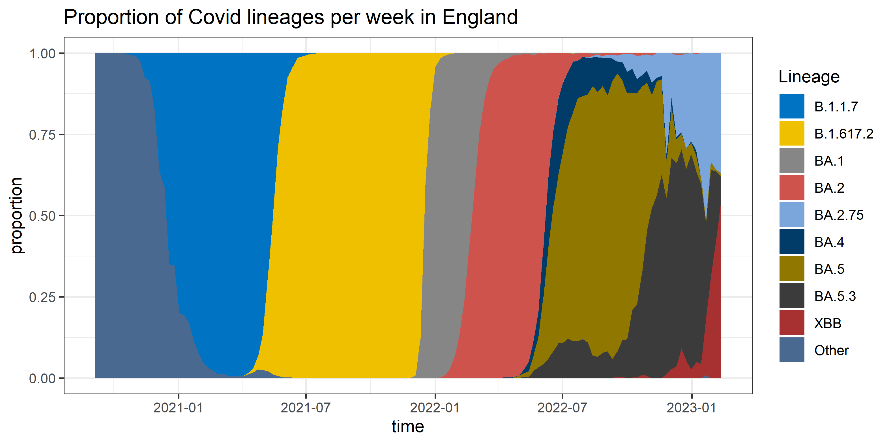

```{r setup, include=FALSE}
knitr::opts_chunk$set(echo = TRUE, warning = FALSE, message = FALSE)
```

```{r loading libraries and functions}
rm(list = ls())

## loading libraries
library(tidyverse)
library(here)
library(RColorBrewer)

## installing self made functions
source(here("Data", "Functions.R"))
```

# Question 1

## 1.

```{r loading data}
GenPerWeek <- read.csv(here("Data", "Genomes_per_week_in_England.csv"))
```

## 2.

```{r Changing non major lineages to "Other"}
## defining major lineages
MajLin <- c("B.1.1.7", "B.1.617.2", "BA.1", "BA.2", "BA.2.75", 
            "BA.4", "BA.5", "BA.5.3", "XBB", "Other")

## altering the values in the column to Other if not major
GenPerWeek <- GenPerWeek %>% 
  mutate(lineage = case_when(
    lineage %in% MajLin ~ lineage, TRUE ~ "Other"), # changing values not in major lineages to "Other"
    lineage = factor(lineage, levels = MajLin),date = as.Date(date)) %>%  # converting the lineage into categorical factors and the date into a date
  group_by(date, lineage) %>% # grouping values from the same lineage and week
  summarise(count = sum(count)) # adding them all together into one value
```

## 3.

```{r visualation in a stacked area plot}
## using a self made function to create the stacked area plot
stacked_area_plot(GenPerWeek, GenPerWeek$date, "time", GenPerWeek$count,
                  "total counts", GenPerWeek$lineage, 
                  "total counts of Covid lineages per week in England",
                  "TotalCountsAP.png")
```


```{r Proportion graph}
## calculation proportion values
# creating a new dataframe which contains the total counts for each week
TotCount <- aggregate(GenPerWeek$count, by = list(date = GenPerWeek$date), 
                      FUN = sum)
# changing the column names so it can be added back
colnames(TotCount) <- c("date", "total_count")
# adding the total counts to each row from a set week
GenPerWeek <- merge(GenPerWeek, TotCount, by = "date")
# creating a new column with the calculated proportion
GenPerWeek$proportion <- GenPerWeek$count / GenPerWeek$total_count

## using a self made function to create the stacked area plot
stacked_area_plot(GenPerWeek, GenPerWeek$date, "time", GenPerWeek$proportion,
                  "proportion", GenPerWeek$lineage, 
                  "Proportion of Covid lineages per week in England", 
                  "ProportionAP.png")
```



# Question 2

## 1.

```{r Loading Data}
ONSData <- read.csv("https://raw.githubusercontent.com/mg878/variant_fitness_practical/main/lineage_data.csv")
# Ensure collection_date is in Date format
ONSData$collection_date <- as.Date(ONSData$collection_date)

ONSSum <- aggregate(
  ONSData$major_lineage,
  by = list(collection_date = ONSData$collection_date, major_lineage = ONSData$major_lineage),
  FUN = length
)

# Rename columns for clarity
colnames(ONSSum) <- c("collection_date", "major_lineage", "lineage_count")

# Calculate total counts per date
total_counts <- aggregate(ONSSum$lineage_count, by = list(collection_date = ONSSum$collection_date), FUN = sum)
colnames(total_counts) <- c("collection_date", "total_count")

# Merge total counts back into the lineage summary
ONSSum <- merge(ONSSum, total_counts, by = "collection_date")

# Calculate frequencies
ONSSum$lineage_frequency <- ONSSum$lineage_count / ONSSum$total_count

ONSSum$collection_date_bin <- as.Date(
  floor(as.numeric(as.Date(ONSSum$collection_date)) / 10) * 10, origin = "1970-01-01"
)

# Aggregate lineage counts for each 10-day bin
ONSSumBin <- aggregate(
  lineage_count ~ collection_date_bin + major_lineage,
  data = ONSSum,
  FUN = sum
)

# Calculate total counts within each bin
total_counts <- aggregate(
  lineage_count ~ collection_date_bin,
  data = ONSSumBin,
  FUN = sum
)
colnames(total_counts) <- c("collection_date_bin", "total_count")  # Rename for clarity

# Merge total counts back into the binned data
ONSSumBin <- merge(ONSSumBin, total_counts, by = "collection_date_bin")

# Recalculate frequencies
ONSSumBin$lineage_frequency <- ONSSumBin$lineage_count / ONSSumBin$total_count

```

## 2.
